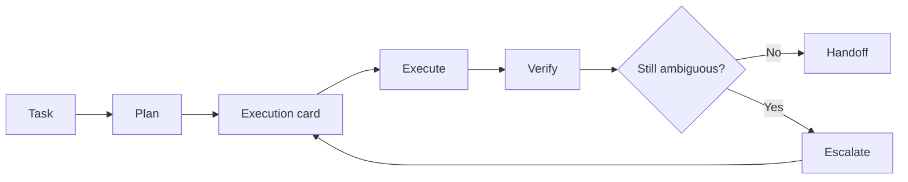

<p align="center">
  
</p>

<h1 align="center">Cost-Aware Agent Work</h1>

<p align="center">
  <b>A plain-Markdown rulebook for using AI agents without wasting premium reasoning, context, or output tokens.</b>
</p>

<p align="center">
  <code>model-agnostic</code>
  ·
  <code>no installer</code>
  ·
  <code>no telemetry</code>
  ·
  <code>copy-paste friendly</code>
</p>

<p align="center">
  <i>Use the strongest model to make the task narrow, not to do every narrow step.</i>
</p>

---

## What this is

Cost-Aware Agent Work is a small operating guide for running AI agents more efficiently.

➔ [Read the skill](skills/cost-aware-agent-work/SKILL.md)

It helps separate:

| High-leverage work    | Mechanical work  |
| --------------------- | ---------------- |
| planning              | formatting       |
| architecture choices  | log extraction   |
| risk analysis         | simple summaries |
| ambiguous debugging   | bounded edits    |
| verification strategy | final handoffs   |

The goal is not to make agents “cheap at all costs.”

The goal is to spend premium reasoning only where it changes the outcome.

---

## What this is not

This repo is intentionally minimal.

| Not included       | Why                                              |
| ------------------ | ------------------------------------------------ |
| Installer          | Users should inspect the rules before using them |
| Background process | This is a rulebook, not an agent runtime         |
| API keys           | No provider integration required                 |
| Telemetry          | Nothing is collected                             |
| Hidden prompts     | Everything is plain Markdown                     |
| Framework lock-in  | Copy the parts that fit your tool                |

---

## Core principle

```text
Use premium reasoning to reduce uncertainty.
Use cheaper execution once the path is narrow.
Escalate only when ambiguity remains.
```

Most usage waste comes from running the strongest model through every phase:

```text
plan → search → read → edit → debug → summarize → repeat
```

This rulebook turns that into a more disciplined loop:

```text
plan → execute → verify → escalate only if needed → handoff
```

---

## Workflow


<p align="center">
  <i>The diagram is the intended operating loop, not a required runtime.</i>
</p>

---

## The model ladder

Use stronger reasoning where uncertainty is high. Use cheaper reasoning where the task is bounded.

| Phase    | Recommended mode      | Output                           |
| -------- | --------------------- | -------------------------------- |
| Plan     | high / premium        | execution card                   |
| Execute  | medium / lower effort | changes or findings              |
| Verify   | low / medium          | test result or extracted failure |
| Escalate | high / premium        | revised plan                     |
| Handoff  | low / medium          | compact status summary           |

---

## Execution card

For expensive tasks, start by asking the agent to produce an execution card.

```text
Execution card:
- goal
- likely files or sources
- files or sources not to touch
- implementation or research path
- risks
- verification command or evidence standard
- definition of done
- fallback if blocked
```

The execution card should be short. Its job is to reduce uncertainty, not explain everything.

---

## Budget header

Paste this at the top of expensive agent tasks:

```text
Budget discipline:
- one planning pass only
- keep outputs compact
- do not narrate routine work
- use selected files or sources only
- summarize logs before reasoning over them
- escalate only if ambiguity remains
- final response must be a concise handoff
```

---

## Cache-stable prompt layout

If your provider or agent runtime supports prompt caching, stable context should stay stable.

| Stable prefix        | Dynamic suffix        |
| -------------------- | --------------------- |
| project rules        | current task          |
| coding conventions   | latest error          |
| quality rubric       | changed files         |
| standing constraints | fresh test output     |
| branch policy        | specific question     |
| known commands       | current blocker       |
| output format        | requested next action |

Put reusable instructions first. Put changing task details later.

---

## When to escalate

Stay in medium or lower-effort mode when:

```text
target files or sources are known
failure is local
test output is clear
patch is small
next action is obvious
```

Escalate to high or premium reasoning when:

```text
architecture choice is unclear
multiple subsystems conflict
tests fail for unclear reasons
public API or irreversible behavior is involved
wrong abstraction risk is high
review or mergeability risk is high
```

Every escalation should have a reason.

---

## Anti-patterns

Avoid these common usage burners:

| Anti-pattern                                         | Better approach                             |
| ---------------------------------------------------- | ------------------------------------------- |
| Highest reasoning for every step                     | Premium planning, bounded execution         |
| Broad context rereads                                | Selected files/sources only                 |
| Long final summaries                                 | Compact handoff                             |
| Debugging without a plan                             | Revise the execution card                   |
| Premium model for log cleanup                        | Extract failures with cheaper reasoning     |
| Constant prompt rewriting                            | Keep a cache-stable prefix                  |
| Treating advertised context as usable budget         | Track active context separately             |
| Treating cumulative billed tokens as current context | Separate billing, cache, and active context |

---

## Install / use

There is no executable installer.

Clone the repo:

```bash
git clone https://github.com/0xQuantCat/cost-aware-agent-work.git
cd cost-aware-agent-work
```

Then read and copy the skill file:

```text
skills/cost-aware-agent-work/SKILL.md
```

into the skill or instruction location supported by your agent tool.

You can also copy the relevant rules into project-level instruction files such as:

```text
AGENTS.md
CLAUDE.md
.cursor/rules/
other tool-specific instruction files
```

Use only the parts that fit your workflow.

---

## Repository structure

```text
cost-aware-agent-work/
├── README.md
├── LICENSE
├── assets/
│   └── thumbnail.png
└── skills/
    └── cost-aware-agent-work/
        └── SKILL.md
```

---

## Safety posture

This repo is intentionally plain Markdown.

```text
no install script
no network calls
no shell hooks
no API keys
no telemetry
no hidden prompts
```

Read the skill before using it. Copy only what you trust.

---

## Suggested article CTA

```text
I put the checklist in a small public repo:

github.com/0xQuantCat/cost-aware-agent-work

Clone it, read the SKILL.md, and copy it into your agent/tool setup.

No installer. No background process. Just a plain Markdown rulebook for cost-aware agent work.
```

---

## License

MIT.
