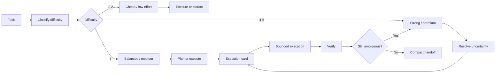

<p align="center">
  
</p>

<h1 align="center">Cost-Aware Agent Work</h1>

<p align="center">
  <b>A plain-Markdown rulebook for routing AI agent work by difficulty, uncertainty, and cost.</b>
</p>

<p align="center">
  <code>model-agnostic</code>
  ·
  <code>router-compatible</code>
  ·
  <code>no installer</code>
  ·
  <code>no telemetry</code>
  ·
  <code>copy-paste friendly</code>
</p>

<p align="center">
  <i>Use the strongest model to make the task narrow, not to do every narrow step.</i>
</p>

<p align="center">
  <a href="skills/cost-aware-agent-work/SKILL.md"><b>Read the SKILL.md</b></a>
</p>

---

## What this is

Cost-Aware Agent Work is a small operating guide for running AI agents more efficiently.

It helps you decide:

| Question | Why it matters |
| --- | --- |
| How hard is this task? | Difficulty should influence model choice |
| Is the path already clear? | Clear paths do not need premium reasoning |
| What can be executed mechanically? | Mechanical work should not burn frontier tokens |
| When should the agent escalate? | Ambiguity, not habit, should trigger stronger reasoning |
| What should stay stable? | Stable context is more cache-friendly |

The goal is not to make agents “cheap at all costs.”

The goal is to spend premium reasoning only where it changes the outcome.

---

## What this is not

This repo is intentionally minimal.

| Not included | Why |
| --- | --- |
| Installer | Users should inspect the rules before using them |
| Background process | This is a rulebook, not an agent runtime |
| API keys | No provider integration required |
| Telemetry | Nothing is collected |
| Hidden prompts | Everything is plain Markdown |
| Framework lock-in | Copy the parts that fit your tool |

---

## Core principle

```text
Use premium reasoning to reduce uncertainty.
Use cheaper execution once the path is narrow.
Route by difficulty, not by habit.
Escalate only when ambiguity remains.
```

Most usage waste comes from running the strongest model through every phase:

```text
plan → search → read → edit → debug → summarize → repeat
```

This rulebook turns that into a more disciplined loop:

```text
classify → plan → execute → verify → escalate only if needed → handoff
```

---

## Workflow



<p align="center">
  <i>The diagram is the intended operating loop, not a required runtime.</i>
</p>

---

## Difficulty ladder

Use this as a manual routing policy, or as guidance for tools that route requests across models.

| Level | Difficulty | Use for | Typical mode |
| --- | --- | --- | --- |
| 1 | Trivial | typos, formatting, tiny rewrites, simple extraction | cheapest / low |
| 2 | Easy | clear local edits, obvious log parsing, small cleanup | cheap / low |
| 3 | Normal | bounded implementation, known files, ordinary debugging | balanced / medium |
| 4 | Hard | unclear failures, multi-file reasoning, public API risk | strong / high |
| 5 | Expert | architecture, ambiguous strategy, mergeability risk, irreversible choices | frontier / premium |

The important rule:

```text
Do not route the whole task once.
Route each phase.
```

A task may need premium reasoning for planning and cheaper execution afterward.

---

## Optional routing tools

This repo does **not** require a router.

It can be used manually, inside a custom harness, or alongside an optional routing tool.

Examples of compatible approaches:

| Approach | What it does |
| --- | --- |
| Manual routing | You choose the model/reasoning level using the difficulty ladder |
| Custom harness | Your own script maps difficulty to model choice |
| Switchboard or similar tools | A paid/third-party router can send easy tasks to cheaper models and hard tasks to frontier models |
| Hybrid | Use routing for routine work, but require explicit escalation for high-risk decisions |

The rulebook is the policy layer. A router is only an implementation option.

Do not depend on any paid routing service unless it fits your workflow, budget, privacy needs, and toolchain.

---

## Model ladder

Use stronger reasoning where uncertainty is high. Use cheaper reasoning where the task is bounded.

| Phase | Recommended mode | Output |
| --- | --- | --- |
| Classify | cheap / medium | difficulty level |
| Plan | high / premium | execution card |
| Execute | medium / lower effort | changes or findings |
| Verify | low / medium | test result or extracted failure |
| Escalate | high / premium | revised plan |
| Handoff | low / medium | compact status summary |

---

## Execution card

For expensive tasks, start by asking the agent to produce an execution card.

```text
Execution card:
- goal
- difficulty level: 1-5
- likely files or sources
- files or sources not to touch
- implementation or research path
- risks
- verification command or evidence standard
- definition of done
- fallback if blocked
- escalation triggers
```

The execution card should be short. Its job is to reduce uncertainty, not explain everything.

---

## Budget header

Paste this at the top of expensive agent tasks:

```text
Budget discipline:
- classify task difficulty before choosing effort
- one planning pass only unless blocked
- keep outputs compact
- do not narrate routine work
- use selected files or sources only
- summarize logs before reasoning over them
- route trivial/easy work to cheaper modes when available
- escalate only if ambiguity remains
- final response must be a concise handoff
```

---

## Cache-stable prompt layout

If your provider or agent runtime supports prompt caching, stable context should stay stable.

| Stable prefix | Dynamic suffix |
| --- | --- |
| project rules | current task |
| coding conventions | latest error |
| quality rubric | changed files |
| standing constraints | fresh test output |
| branch policy | specific question |
| known commands | current blocker |
| output format | requested next action |
| routing policy | current difficulty rating |

Put reusable instructions first. Put changing task details later.

---

## When to escalate

Stay in cheap, medium, or lower-effort mode when:

```text
target files or sources are known
failure is local
test output is clear
patch is small
next action is obvious
task is reversible
```

Escalate to high or premium reasoning when:

```text
architecture choice is unclear
multiple subsystems conflict
tests fail for unclear reasons
public API or irreversible behavior is involved
wrong abstraction risk is high
review or mergeability risk is high
security, data loss, or production risk is involved
```

Every escalation should have a reason.

---

## Anti-patterns

Avoid these common usage burners:

| Anti-pattern | Better approach |
| --- | --- |
| Highest reasoning for every step | Difficulty routing + premium planning |
| One model for every phase | Classify each phase separately |
| Broad context rereads | Selected files/sources only |
| Long final summaries | Compact handoff |
| Debugging without a plan | Revise the execution card |
| Premium model for log cleanup | Extract failures with cheaper reasoning |
| Constant prompt rewriting | Keep a cache-stable prefix |
| Treating advertised context as usable budget | Track active context separately |
| Treating cumulative billed tokens as current context | Separate billing, cache, and active context |
| Blind automation loops | Add escalation gates and stop conditions |

---

## Install / use

There is no executable installer.

Clone the repo:

```bash
git clone https://github.com/0xQuantCat/cost-aware-agent-work.git
cd cost-aware-agent-work
```

Then read and copy the skill file:

```text
skills/cost-aware-agent-work/SKILL.md
```

into the skill or instruction location supported by your agent tool.

You can also copy the relevant rules into project-level instruction files such as:

```text
AGENTS.md
CLAUDE.md
.cursor/rules/
other tool-specific instruction files
```

Use only the parts that fit your workflow.

---

## Router compatibility

This repo does not install, require, or endorse a specific router.

It pairs naturally with routing systems because it defines the missing policy layer:

```text
difficulty classification
model ladder
escalation gates
compact handoff format
anti-loop rules
cache-stable prompt layout
```

If you use Switchboard or any similar router, configure it to reserve frontier models for ambiguity, planning, and high-risk decisions, while sending reversible low-difficulty work to cheaper models.

---

## Repository structure

```text
cost-aware-agent-work/
├── README.md
├── LICENSE
├── assets/
│   └── thumbnail.png
└── skills/
    └── cost-aware-agent-work/
        └── SKILL.md
```

---

## Safety posture

This repo is intentionally plain Markdown.

```text
no install script
no network calls
no shell hooks
no API keys
no telemetry
no hidden prompts
```

Read the skill before using it. Copy only what you trust.

---

## Suggested article CTA

```text
I put the checklist in a small public repo:

github.com/0xQuantCat/cost-aware-agent-work

Clone it, read the SKILL.md, and copy it into your agent/tool setup.

No installer. No background process. Just a plain Markdown rulebook for cost-aware agent work.
```

---

## License

MIT.
